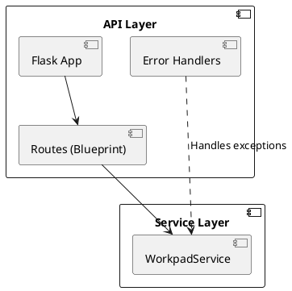

# API REST Layer

The API Layer exposes the functionality of the Service Layer via HTTP endpoints, following RESTful principles.

## Architecture

The API is built with Flask and organized using Blueprints.



## Endpoints

### Entries

| Method | Path | Description |
|Utils|---|---|
| GET | `/api/v1/entries` | List entries (supports filtering) |
| POST | `/api/v1/entries` | Create a new entry |
| GET | `/api/v1/entries/<id>` | Get entry by ID |
| PUT | `/api/v1/entries/<id>` | Update entry |
| DELETE | `/api/v1/entries/<id>` | Delete entry |

### Context

| Method | Path | Description |
|---|---|---|
| POST | `/api/v1/entries/<id>/context` | Add context item |
| DELETE | `/api/v1/entries/<id>/context/<ctx_id>` | Remove context item |

### Relations

| Method | Path | Description |
|---|---|---|
| POST | `/api/v1/entries/<id>/relations/<rel_id>` | Create bidirectional relation |
| DELETE | `/api/v1/entries/<id>/relations/<rel_id>` | Remove relation |

## Configuration

The API is configured via `workpad/config.py` and environment variables.

- `WORKPAD_DATA_PATH`: Path to the data directory (default: `./data`).

## Running the API

```bash
# Development
flask --app workpad.api:create_app run
```
