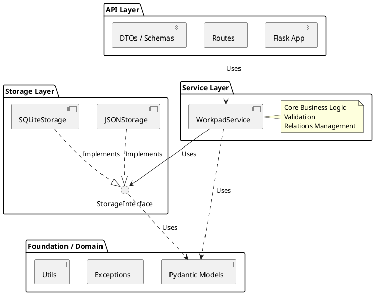

# Architecture Overview

Workpad follows a **Microservice-as-Library** architecture. It is designed to be cleanly layered, separating data storage, business logic, and API exposure.

## Layers

### 1. Foundation Layer
Defines the core domain objects using **Pydantic**. This ensures strict typing and validation across all layers.
- See [FOUNDATION_LAYER.md](FOUNDATION_LAYER.md)

### 2. Storage Layer
Defines a `StorageInterface` protocol.
- **JSONStorage**: File-based, good for portability and git-ops.
- **SQLiteStorage**: Relational, good for performance and complex queries.
- See [SQLITE_STORAGE.md](SQLITE_STORAGE.md)

### 3. Service Layer
The brain of the application (`WorkpadService`). It handles:
- ID generation
- Timestamp management
- Relation integrity (linking/unlinking)
- Context attachment
- See [SERVICE_LAYER.md](SERVICE_LAYER.md)

### 4. API Layer
Exposes the Service Layer via HTTP using **Flask**.
- Stateless (mostly)
- RESTful
- Configurable via Env/YAML
- See [API_LAYER.md](API_LAYER.md)
