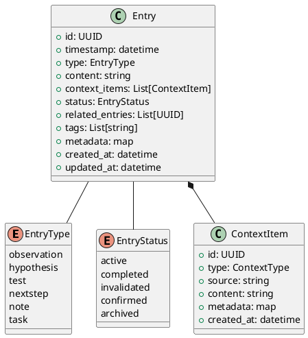
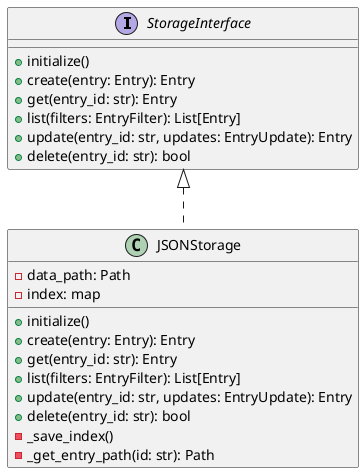

# Workpad Foundation Layer

This document describes the foundation layer of Workpad, which includes the core data models and the storage engine.

## Overview

The foundation layer is responsible for:
- Defining the data structures (`Entry`, `ContextItem`) using Pydantic.
- Providing a consistent interface for storage operations (`StorageInterface`).
- Implementing a file-based JSON storage backend (`JSONStorage`).

## Data Models

The core models are defined in `workpad.models`.



## Storage Architecture

The storage layer is designed to be pluggable. The `JSONStorage` implementation stores entries as individual JSON files on the disk.



## Directory Structure

When using `JSONStorage`, the data is organized as follows:

```
data/
├── entries/
│   ├── YYYY-MM/
│   │   ├── <uuid>.json
│   │   └── ...
└── metadata.json  # Index for fast lookup
```

## Usage Example

```python
from workpad.models import Entry, EntryType
from workpad.storage.json_storage import JSONStorage

# Initialize storage
storage = JSONStorage("./data")
storage.initialize()

# Create entry
entry = Entry(
    type=EntryType.observation,
    content="This is a test entry",
    tags=["example"]
)
storage.create(entry)

# Retrieve entry
loaded = storage.get(entry.id)
print(loaded.content)
```
