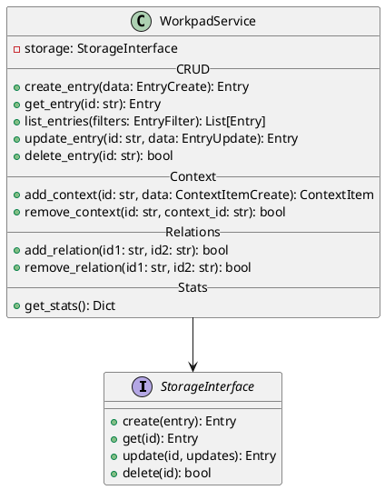

# Service Layer Architecture

The Service Layer acts as the intermediary between the external interfaces (API, CLI) and the persistence layer. It encapsulates all business logic and orchestrates complex operations.

## Architecture



## Key Responsibilities

### 1. Data Transformation
The service converts DTOs (Data Transfer Objects) like `EntryCreate` into domain models (`Entry`) before passing them to storage.

### 2. Validation
It performs business-level validation, such as ensuring an entry cannot be linked to itself.

### 3. Context Management
It handles the addition of context items (`ContextItem`) to entries, ensuring correct instantiation and persistence.

### 4. Relations Management
It manages bidirectional relationships between entries. When `entry A` is linked to `entry B`, the service ensures `entry B` is also updated to reference `entry A`.

## Usage Example

```python
from workpad.service import WorkpadService
from workpad.storage.json_storage import JSONStorage
from workpad.models import EntryCreate, EntryType

# Initialize
storage = JSONStorage("./data")
service = WorkpadService(storage)

# Create
entry = service.create_entry(EntryCreate(
    type=EntryType.task,
    content="Implement feature X"
))

# Stats
stats = service.get_stats()
print(f"Total entries: {stats['total_entries']}")
```
