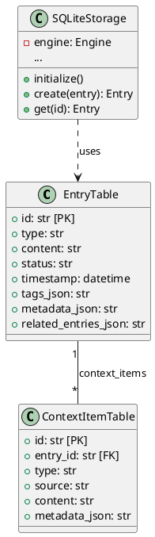

# SQLite Storage Layer

The SQLite Storage Layer provides a relational database backend for Workpad using `SQLModel`.

## Architecture

It implements the `StorageInterface` and maps domain models to SQL tables.



## Schema Logic

- **JSON Fields**: Arrays (tags, related_entries) and Dictionaries (metadata) are stored as JSON strings.
- **Enums**: Stored as strings.
- **Timestamps**: Stored as `datetime` objects.

## Usage

To use SQLite storage, set the `WORKPAD_STORAGE_TYPE` environment variable or configure `Settings`.

```python
from workpad.storage.sqlite_storage import SQLiteStorage
storage = SQLiteStorage("./data") # Creates ./data/workpad.db
storage.initialize()
```
